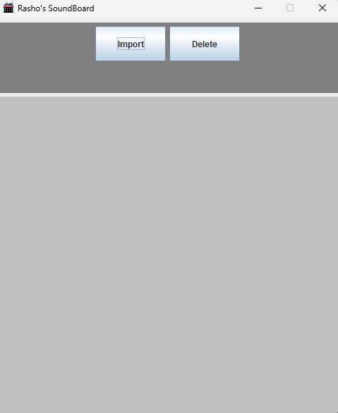
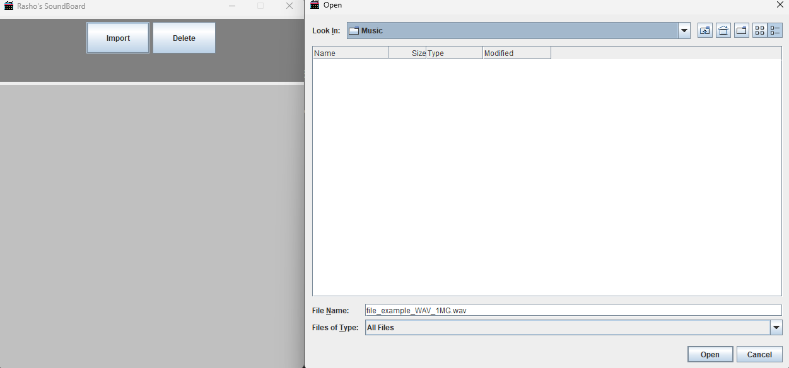
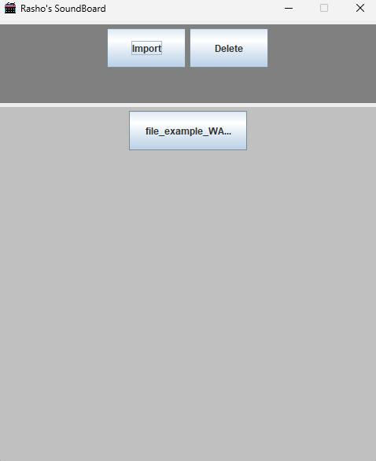

# Rasho's Soundboard

A Java Program that lets users store their sounds in a lightweight software 

## Features 
- Lets the user import the sounds they want to use 
- Also lets the user Delete the sounds they do not want to use 

## Visuals 

## Installation

Clone this Repository 

## Roadmap 

-Will implement keybind feature 
-Edit option to change keybind 
-Better looking GUI 
-Multi platform Support 

